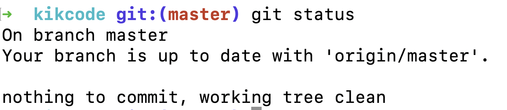
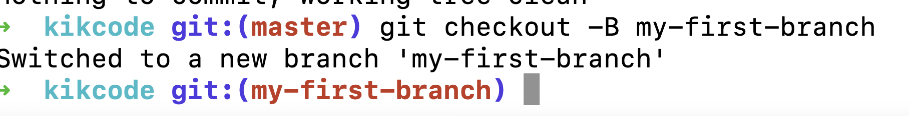
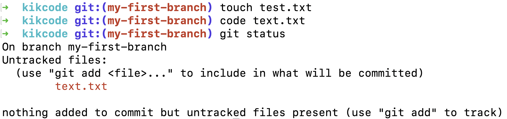
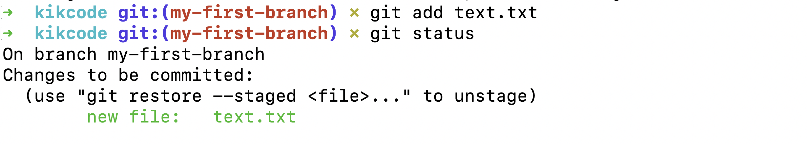
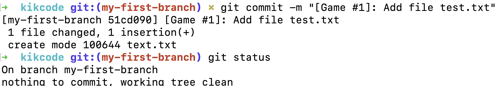
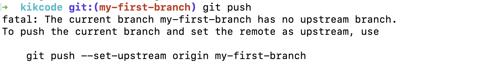
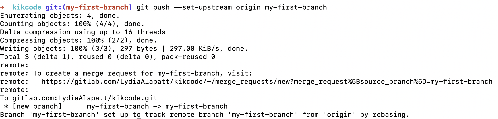

# Git Cheat Sheet

For more detailed information see https://git-scm.com/docs

For the video tutorial see https://www.youtube.com/watch?v=Y6ahL8nbVpk

## Golden Path

1. git pull (before you create a new branch)
2. git checkout -B my-first-branch
3. Do stuff
4. git status
5. git add
6. git commit 
7. git push

### Example with images
1. git status after you pulled 
2. Create a new branch 
3. Create a text file and check status
4. Add text file and check status 
5. Commit your file and check status 
6. Push your changes. This message will appear when you do not have a remote branch yet 
7. Push and create upstream 

## Useful commands 

### Clone into an existing repository
```git clone git@code.fbi.h-da.de:owner/project-name.git```

Cloning using ssh.

### Integrate changes from remote branch into your local branch
```git pull```

Basically a fetch and checkout.

### Get changes from remote branch (without checkout)
```git fetch```

First half of pull.

### Create a new branch and and check it out
```git checkout -B <branch-name>```

Do not use spaces in the name. Use hyphen or underscore as delimiter.


### Create a new branch 
```git branch <branch-name>```

This will *not* checkout the new branch. You will stay on your current branch.

### Checkout a branch
```git checkout <branch-name>```

Checks out (switches) to the branch with the given name.

### Delete branch
```git branch -d <branch-name>```

Only deletes a branch if it has already been pushed and merged with the remote branch.

```git branch -D <branch-name>```

This forces a branch to delete even if the branch hast not been pushed or merged.

### Show the status
```git status```


### Add untracked files

Add a single file

```git add <file>```

Add all files

``` git add -A```

Add current directory

```git add .```

Reminder: the dot ( . ) is your current directory. The one your are in.

Add directory docs

```git add ./docs```

### Commit changes
```git commit -m <message>```

For example: git commit -m "[Game #1]: Add file test.text"

### Push your changes to the remote branch
```git push```

### Restore deleted file 
If you accidentally deleted a file from your local branch, you can restore it with:

```git checkout HEAD <file>```

This only works if the file was already pushed and is on the remote branch

### Show history of current branch
```git log```