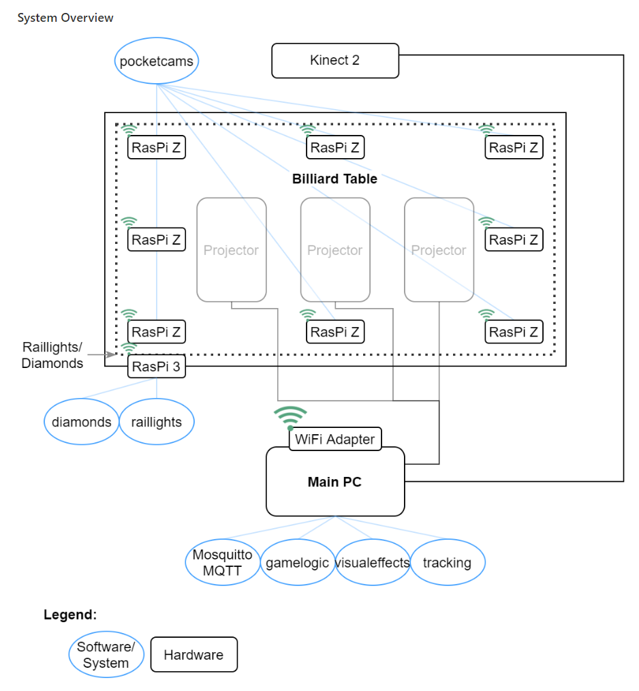

# Project idea
The basic idea for this project was to create a special experience for playing billiards that utilizes a custom billiard-table with several technological features and software to accompany these.
For the students who contribute to this legacy-project, the focus is more on continued development of the software, rather than making changes to the hardware and other physical components of the billiard-table.

The following graphic shows a system-design that was made by the project-group of WS19/20, which helps to visualize how the custom multimedia-billiard-table is set up:

The graph does not necessarily represent the current reality of how the table is set up in detail or what software it uses, but it should provide a good overview of what you are working with.

The playing area of the table is a transparent board under which multiple projectors have been installed, so that they can project a video feed onto the board.
These projections are then visible to players who view the table from above and they can be used to provide special features like displaying what path a billiard ball would take when a player is preparing to strike it.

To get there, several other steps of capturing information and processing it have to be taken first.
Installed above the billiard-table is a Kinect 2 camera which can record the entire playing area and provide a video feed of it.
The idea is to forward that video feed to a tracking-software, which uses image-recognition techniques to perform tasks like identifying billiard-balls and their movements across the playing area of the table.
The processing-results of the previous step are then used to virtually represent information like the state of the billiard-balls or a game and provide feedback to the player, which includes the aforementioned example of path prediction displays.

With the special working-conditions created by the Covid-19 pandemic and the inability to freely access and work with the custom billiard-table located on campus, a new requirement was added to the project:
In addition to the aforementioned software, a simulation to replace the real hardware has to be implemented, so that system-components like the tracking-software can receive authentic input and operate the same way as they would with the intended hardware.
