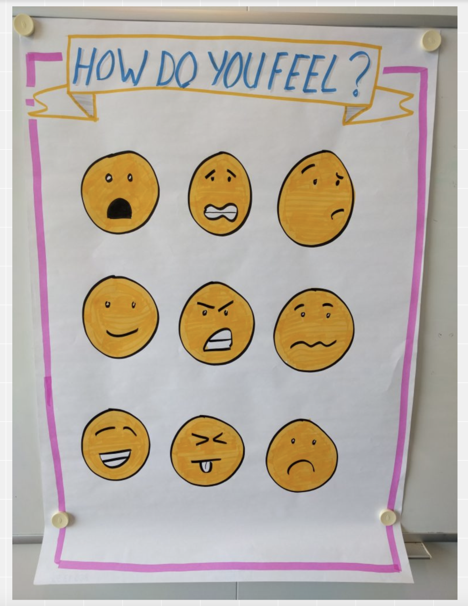

# Retrospective

## General Help

Usually the Scrum master chooses two game-like exercises. 
The first one should motivate the team to overthink the last Sprint and to get everyone to say something. If everyone has already said something in the first exercise, the hurdle is usually a little smaller to contribute something and explain yourself in the second (and more important) exercise.

In the first exercise, the team should think about the general feeling during the Sprint. They don't have to go into specific issues that were good or bad. The main purpose of this exercise is to recap and analyze the sprint in general.

The second exercise then goes more into detail. As the Scrum Master ask the team to write down what went well and what can be improved.
Avoid asking about things that went bad. This can drag the team down or have a negative impact on future work, as it could convey that you can't change these things anyway. There can always be problems like this, especially at university, when you are studying more subjects and therefore you may not have been able to invest as much time in the project.
But when things are in need of improvement, you can then consider measures that can help ensure that things really improve (and that is what you do after the second exercise). 

Team (in this case) is the Scrum Team, not only the Development Team, so Scrum Master and Product Owner are also taking part at the exercises. 

_Tip for the Scrum Master_: Choose different exercises for each Retro. There are lots of examples available on the internet and otherwise it get's a bit boring for the team and may not be that constructive it could be. 

---

The following exercises are examples used of Group 7 (WiSe 21/22). They may help future teams but they don't have to use them. 

We used this [Concept Board Website](https://app.conceptboard.com) to do the Retrospectives. The Scrum Master needs an free account for that, but no one else. He / she can share the link and give the rights for everyone with the link to edit, so that the team can work at the exercises. 

## First Retrospective

In this exercise each team member should paint their feelings about this Sprint. It doesn't matter if they paint an animal, a smiley face, a person or whatever, they should just paint what they can think of and what fits their feelings. 
Give them 3 - 5 minutes for that, but not longer. 
After that each team member tells which painting he / she did and why, so everyone get's a first impression of the feelings of the other members. 

Example:

As explained in [General Help](#general-help) the team should write down all things that went well and what can be improved. Give them 5 - 7 minutes for that. 
After that go through all written comments and let the person who wrote it explain it. 

Example:

## Second Retrospective

In this exercise give the team about 1 minute to choose one of the shown smiley faces which represents their feelings best. Each team member tells the group which he / she selected and why. 

Example for smiley faces:

This exercise is called "Auf Hoher See" and you can explain it as you are the captain of a ship. 
And while your sailing there are four possibilities: calm sea, treasure, dangerous cliffs or fog. 

* Calm Sea: write down everything that works well but is nothing special
* Treasure: write down what is really special and great
* Dangerous Cliffs: write down what can cause problems or is already a problem
* Fog: write down what is not clear

Give the team 5 - 7 minutes for that. After that go through all written comments and let the person who wrote it explain it.

Example:

## Third Retrospective

In this exercise give the team about 1 minute to choose one of the shown wheather images which represents their feelings best (comparable to the smiley faces). Each team member tells the group which he / she selected and why. 

Example for wheather images:

This exercise is called "WWW" and the three "w" stand for wow, wondering if OK and worried (I think it's self explaining). We used it to review the scrum roles, meetings and artifacts, but you can use the three W of course for every item you would like to review with the team.

Give the team 5 minutes to go through the fields and set a dot for how they think about the items. After that go through all fields where there are points in "wondering if OK" or in "worried" and let them explain why they choose that.

Example:

## Fourth Retrospective

In this exercise give the team 2-3 minutes to write down one word that describes their feelings for this sprint the best. Each team member tells the group which he / she wrote and why. 

Example:

The team should write down all things that went well, what they learned, what can be improved and what they longed for. Give them 5 - 7 minutes for that.
After that go through all written comments (or just focus on what can be improved and what they long for) and let the person who wrote it explain it.

Example:

## Last Retrospective

For the last retrospective there is no need of collecting measures for future sprints because there are no future sprints. So I decided to ask the team what was positive, surprising, confusing and what was negative about all sprints and the whole project. 
That way we can easily summarize everything that is important to tell and may help the groups who are working with this project after us. 

Example:

