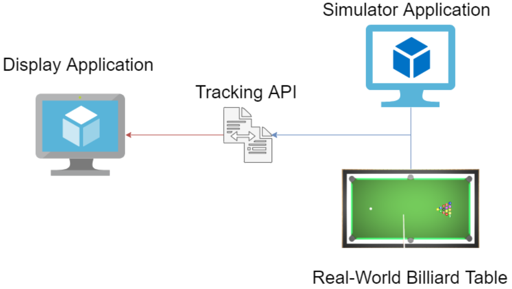

# Software architecture
The current software architecture is the result of the work of previous groups and has changed a lot over time. It therefore is not set in stone and can be changed and reworked as later groups see fit.

As things currently are, the software for the multimedia-billiard-table is generally perceived to consist of 4 'components' (for a lack of a better term). These are the Simulator, Tracking, Game-Logic and Display. All of these are combined in a single Unity-project.

The Simulator is responsible for creating a playable simulation of a real billiard-table, with reasonably accurate physical properties, and providing the Tracking-component with the required input that would normally come from the Kinect 2 camera in the lab.  
The input would be in the form of images or a constant video feed where possible preprocessing steps can be taken, such as including depth-information.  
The Tracking-component is meant to be constructed in such a way that allows both the real multimedia-table and the simulation of it to provide the input interchangeably. After identifying and tracking the position and movements of relevant objects like the billiard balls, these data are then forwarded to the Game-Logic-component.  
This is where game-rules are applied and visual feedback for the player is calculated, which would be projected onto the playing area of the multimedia-billiard-table.  
Last in the chain is the Display-component. The Display-component is currently set up as a [Prefab](https://docs.unity3d.com/Manual/Prefabs.html), so that it can be inserted into different Unity-scenes and still operate in the same way. This component is controlled by the Game-Logic-component and contains everything that should be displayed on a billiard-table, both real and simulated.
