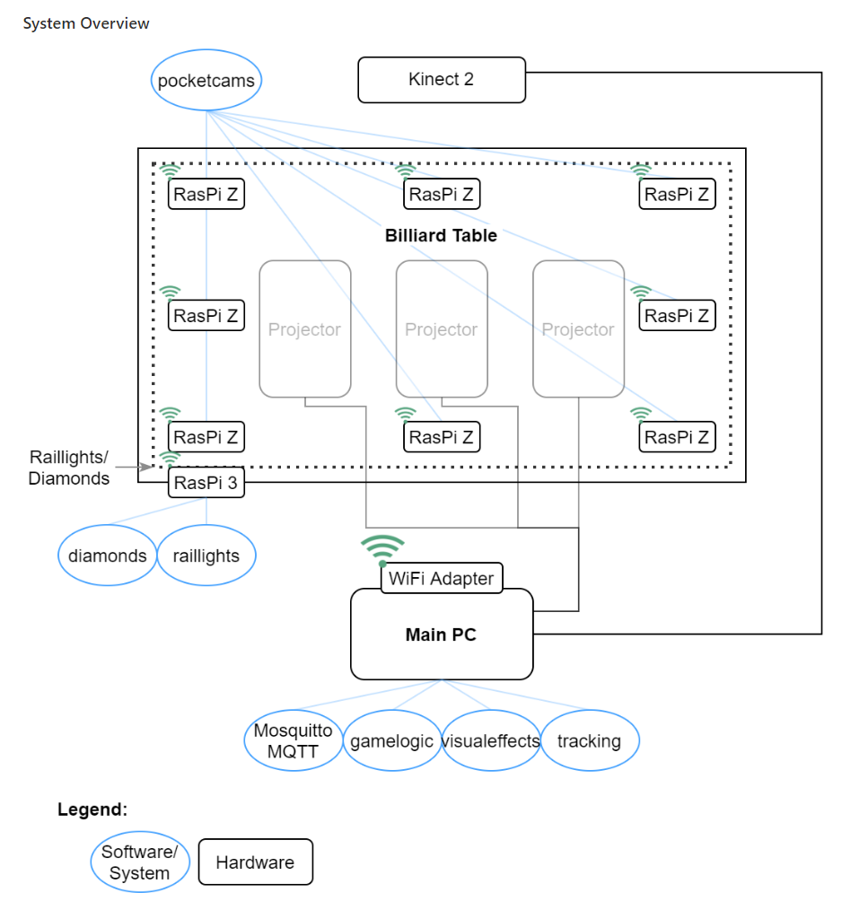

# Multimedia Billiard Table

A billiard table with additional features such as the tracking of balls and
projectors for displaying a responsive playing field.

## General Concept

The concept of a traditional billiard table is expanded upon.
This is done with the help of additional hardware:

* Main PC tower
  * Providing a wireless network via a WiFi adapter
* 3 Projectors creating one image connected to the main PC
* Kinect 2
  * Mounted above the table and connected to the main PC
* Raspberry Pi 3
* Rail lights (LED Stripe)
  * Connected to the Raspberry Pi 3
* Diamonds (LEDs)
* 8 Raspberry Pi Zeros in the table pockets
* Power supply unit
  * Powering the rail lights, diamonds and the Raspberry Pis
  
And with the help of a set of systems that are developed in this course:

* gamestart
* gamelogic
* tracking
  * tracking-labeling
* diamonds
* raillights
* pocketcams
* visualeffects

These systems might run on the main PC or different hardware such as a Raspberry
Pi. All systems communicate over one MQTT broker running on the main PC.

The systems support the players whilst playing or setting up a billiard game.
For this the *gamelogic* system checks for rule violations and guides the
players through the game. All the necessary information is received through MQTT
messages from the other systems. All commands to display things to the players
are send via MQTT as well. This makes the system expandable and easy to debug.

### System Overview

## Documentation

The current team developed the project in its third round. Meaning many of the
things our predecessors did might not be represented in the current project
anymore.
This is because they have been improved upon or have become obsolete. It could
still be useful to examine old solutions. For this we advice to acquire access
to the old repositories. They probably provide better insights.\
The documentations of our predecessors can still be found in *doc/old*.

Documentation of the current systems exists in their corresponding
*src/<system>* folders.

General documentation can be found in the *doc* folder.

To run the whole project use the *gamestart* system and its documentation.

## Licence

It is intended to publish this repository as an Open Source Project. The exact
licence still needs to be decided. For now, it is not allowed to distribute code
or design material outside of h-da. As a student, you can download to your own
PC for the purpose of contributing to the project during the course.

* Only add code written by yourself. Do not copy & paste random code snippets. (e.g. 'found somewhere on the web')
* Do not add material with unclear license or with rights held by third persons.
* When the project will be published, you will be asked to either
  * be named as one of the authors
  * stay anonymous instead.

Further details will be discussed in the course.
