# Tracking Algorithm

This document describes the new tracking algorithm in full detail. Note that I will not directly explain the code, that's what the comments in the code are for. However, I'll show you what the working principle of the algorithm is, what the idea behind it is, and then reference where you can find the corresponding code files and config params (in the `config.json` file in the Core project).

## Introduction and Terminology

For the tracking system, we use a _Microsoft Kinect_ camera. It produces two video frames: A depth frame and a color frame. Without any processing, this is what they look like:

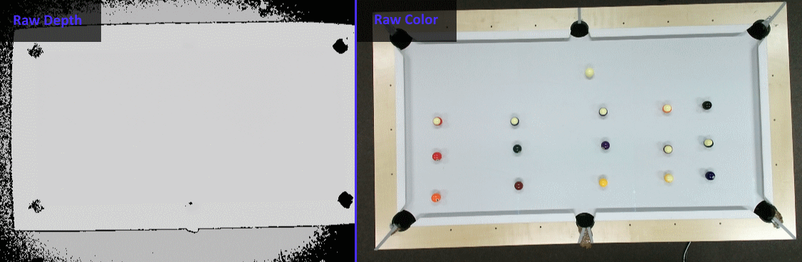

In the code, we have an abstract interface to video sources, and currently the only one that's implemented is the Kinect source. The problem with the Kinect is, that the video and color space are in completely different coordinate spaces. To make matters worse, the depth frame can be arbitrarily distorted and will be smaller than the color frame.

The Kinect SDK provides us with ways to map between those spaces. Our video source automatically converts frames, so that they are the same size and in the same coordinate space. It also scales the depth range to a range that cuts off far away and very close objects, since the table is ~2m away from the cam. This saves us processing time and eliminates artifacts.
These two frames, along with the original unscaled Full HD frame are provided as OpenCV objects to the tracking algorithm. This makes processing easier down the line. These frames now look like this:

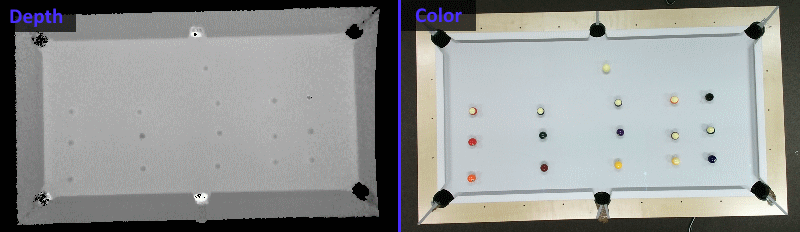

TL;DR: The video source provides 3 frames:

- An undistorted and rescaled depth frame
- A color frame, which is the same size as the depth frame
- The original Full HD color frame

## Architecture

The tracking sytem has two modes:

### Calibration

The calibration mode is the first mode that the system starts into, if there is no configuration data loaded. The table and camera setup in the real world have several problems, which make it difficult for us to track the balls, if we don't compensate for them, namely:

- The table is not level, so different parts of the table have different depth values.
- The table may be rotated, so that the coordinates will get skewed
- There's a lot of noise around the table, both in color and depth space, which results in unneccessary processing and misdetections of balls outside of the table

#### Idea

Luckily, there is a way to mitigate all of these problems, which is calibration. The idea is that we use an empty table as a baseline. Then, we find where the playfield actually is, how it is rotated and what the depth values within it are. We then compute a matrix that can transform the image so that only the playfield is visible, and so that it is perfectly square. This matrix is saved and can later during gameplay be used to very quickly transform the raw image into the playspace.

To improve the accuracy and stability of the calibration process, we do this analysis for each frame over the course of one second and average the results.

#### Implementation

To achieve the goals we set above, we perform the following image analysis steps. Some of the steps are trivial OpenCV operations, while others involve complex custom algorithms.

We begin, by finding the bounds of the table within the depth frame. This is very simple, since during calibration, the table should be the only large rectangular object protruding upwards - therefore being the only large rectangle on the depth frame. Using a canny filter (`CalibrationHandler.cs:116`), we find this rectangle and close any gaps in the result by using a morphological filter.
We then extract the largest contour on the image using OpenCV's `FindContours` method. The `MinAreaRect` of this contour is the rotated rectangle that encloses our table:

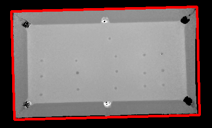

Now, we need to find the playspace on the table. This is less trivial, since the contrast with the billiard cushions is very low. Also, it's not a perfect rectangle, since there are cutouts for the pockets in the corners. Therefore we implemented a custom algorithm to find the playspace in a very stable way (`CalibrationHandler.cs:156`).

First, we take points in fixed distances (`Calibration.DepthSampleDistances`) along the edges of the table we detected. We avoid the corners and the midpoints of each edge, as to not hit the pockets. From there, we cast a ray towards the center of the table, and note the point at which the height drops significantly (`Calibration.DepthSampleThreshold`) along that ray:

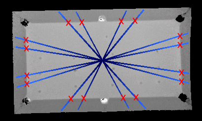

In the screenshot, the rays are marked as blue lines - they go from light towards dark blue. The points that we found to be on that border are the ones that are marked with a red cross. The rectangle that encloses all of these points is our playfield. We check if the area of the playfield is above `Calibration.MinPlayfieldArea` - and if it is, we record it as a sample. This thresholding saves us from one or two frames that failed to properly detect something somwhere along the way ruining the results.

After enough samples, and if we successfully found the rectangle of the playspace, we compute a matrix using OpenCV's `GetPerspectiveTransform` method, which transforms the image in a way so that the image only consists of the playfield. Since we have the color and depth frame in the same coordinate space, we can use this single matrix in both frames later on. 

When we invert the depth frame, and apply the matrix to our depth frame, we get something like this:

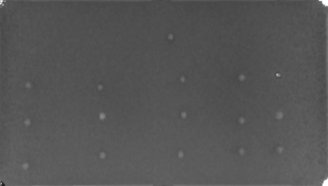

As you can see, the rotation and distortion was completely corrected for, and we now have a nice view of just the playfield.

---

### Tracking

Now that we have a nice and clean depth frame to work with, we need to find the billiard balls. To do this, we perform the following steps:

1. **Baseframe subtraction**: To correct for the table not being entirely level, as well as the table not being at depth zero, we created a baseframe 

2. **Heightmap correction**: To correct for dynamic noise not covered by the baseframe, we also create a heightmap. This heightmap is a frame that was filtered using a low pass filter (Median filter, see `TrackingHandler.cs:302`) to extract only the very low frequency information. This map is then subtracted from the depth frame, which reduces low frequency noise even further. This can be configured with the `Tracking.Heightmap*` properties.

3. **Pocket correction**: The corner pockets generate a lot of interference with the Kinect's infrared distance sensor. However, they conveniently are in the four corners of the image now, because of our nicely transformed depth frame. Since there cannot be balls in the corners anyways (they'd fall down), we erase the pockets with zeroes, to avoid artifacting and false positives there (`TrackingHandler.cs:281`). 

4. **Denoising**: There's a lot of high-frequency noise still in the depth frame not caught by our previous correction steps. Below is a screenshot of our depth frame, with the contrast very greatly exaggerated to show the noise that we deal with:

   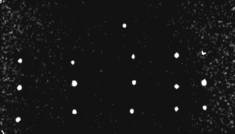

   Therefore, we first apply a high-pass filter and then a bilateral filter to get rid of it. This leaves larger high-frequency blobs (such as balls) intact, but removes smaller blobs that are artifacts. Ideally, we'd use high values for the bilateral filter, but since that is very computationally expensive, I chose lower values which gave reasonably clear images. The bilateral filter size can be configured in `Tracking/BilateralSize`
   Below you can see another screenshot with the filter as above. You can see that the balls are much clearer to see now:

   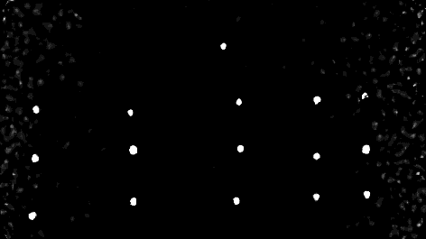

5. **Binarizing**: Now that our balls are level and have their zero point at actual zero and we have a reasonably clear image, we can use a binary threshold filter to detect points where there could be balls (`TrackingHandler.cs:222`). This binary filter can be configured using the `Tracking/BallDepthThreshold` config property

   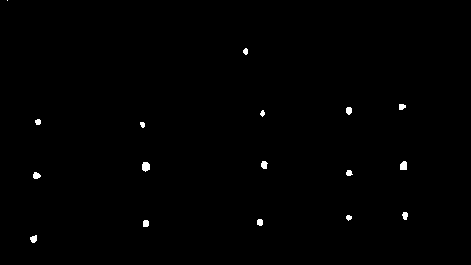

6. **Contour Extraction**: Now, we need to find the circular contours in that frame. We do that again using the `FindContours` algorithm from OpenCV. Blobs found using this algorithm that have a large enough area and circularity (circularity is the ratio between the area of the blob and the area of the blob's minimum enclosing circle). These can be configured in `Tracking/BallAreaThreshold` and `BallCircularityThreshold`. Below you can see the result of this detection system

   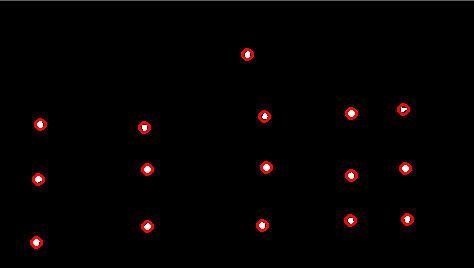

7. **Circle Tracking**: These circles that we found now need to be tracked across multiple frames, so that we know which circle has moved where and what its direction vector currently is. We do this with a simple nearest neighbor algorithm (see `TrackingHandler.cs:151`), which assigns each circle the closest circle from the previous frame. This technique is simple, but has given us great results.

8. **Color Extraction**: Now we need to extract the color from these tracked circles. The problem here is that the balls are not one solid color. There can be half balls which are oriented so that the white part faces the camera and only a very small portion of color is visible. In edge cases like this, it's difficult even for a human to determine the color:

   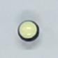

   If we would just take the average in a circle around the center of the ball, we get a lot of the greenish-white center color, and since the detection does not perfectly find the center of the ball, we also can miss the ring of color completely. If we would increase the radius of the average filter, then we get the problem that neighboring balls will skew our result. Therefore, an average color filter is not reliable at all and will result in a lot of misdetections (#AskMeHowIKnow). To mitigate this problem I again implemented a raycasting algorithm (`TrackingHandler.cs:325`):

   - First, we transform the centers of each ball - which are in our nice rectangular playfield space - back to a position that locates the ball in the raw, untransformed and unscaled Full HD image. This can be done by applying the inverse of the matrix we found in the calibration step. The advantage of this is, that the Full HD frame has more pixels per ball, therefore more color pixels, and we therefore have a higher chance to detect the ball correctly.

   - From the point that we got from this transform, we know that it must be on the ball. Now we cast many rays in a circle around this point. The angular offset between the rays, as well as their max length can be configured using the `Tracking.ExtractionAngle` and `Tracking.ExtractionRadius` properties. This is what these rays look like:

     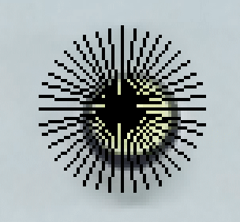

   - For each pixel on the ray we determine a _whiteness_ value. This is a unitless factor, which tells us how close we are to the color that makes up the white part of the billiard ball. This works because the balls are not really white, but have a weird greenish-yellow off-white color with a hue center of 33 (in OpenCV units), a high value and low saturation. Therefore, we can determine this whiteness as follows:

     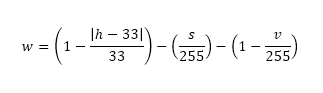

     We clamp this between 0 and 1. If the factor `w` is greater than zero, we found an off-white pixel. If we highlight the pixels that match this criteria, this is what we get:

     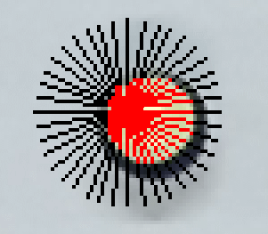

   - We stop iterating the ray if we find a pixel whose saturation is less than 10% so that we don't overscan into the background. We also stop if we find a pixel whose hue is different from the average hue along the ray up until that point, so that we don't overscan into neighboring balls with a different color. If we apply this to a yellow half ball, we get the following result:

     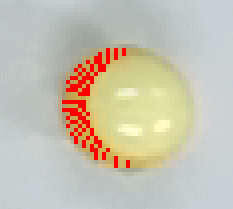

   - We calculate the average color of the pixels that are highlighted in red, as well as a ratio between white and colored pixels (the color ratio). These two values are computed for each ball and sent to the next step.

9. **Ball classification**: Now we have tracked circles and assigned them a HSV color and a color ratio. However, nobody wants to say "This is my `0.39/18,226,178` ball" - we want to say "This is my half orange ball". Therefore, we need a classifier which maps between the two.

   - First, we find the non-colored balls: The one with a color ratio of 0 (no colored pixels) becomes the full white ball. The one with a value below 25 becomes the full black ball.

   - Then, we determine which balls are half and full. Those with a color ratio of less than 50% are assigned the half ball type.

   - Next, we assign the colors. To do that, we iterate all possible balls on the table, and assign to it the circle that is closest in its hue and value. The color ranges that are used here can be specified in the `Classifier.ColorRanges` configuration property set. Not all balls have value ranges associated with them, since for some they are not relevant. (Example: Do distinguish between Orange and Brown, we need to take value into account. However, a green ball is always green, no matter the value).

   - Some colors are very close to one another, so there can be misdetections where two balls match to a half blue ball for example. The classifier (`BallClassifier.cs:45`) therefore only allows each color to be assigned once per frame. The circles that remain are applied to colors based on a very simple nearest neighbor algorithm. This gives us pretty nice results:

     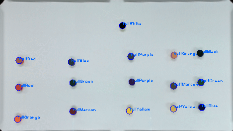

10. **Position normalization**: Up until now, all the ball positions were in "playfield space" which has camera pixels as units. However, consumers of our data (e.g. the Unity client) don't know anything about our pixels. Therefore, we normalize the positions so that the top left corner is position `(0, 0)` and the bottom right corner is `(1, 1)`, everything else is a decimal value in between.

## Testing

You don't need the real table to test and debug the tracking algorithm, since Microsoft provides a beautiful [application called Kinect Studio](https://www.microsoft.com/en-us/download/details.aspx?id=44561), which allows you to simulate Kinect input. I also provide you a small collection of 40GB of Kinect recordings, that you can use to test and demo the algorithm without access to the real hardware. You can find it on the h_da cloud [here](http://wir-muessen.hr-froemmer-nach-access.fragen/undzwarschnell.html). 
