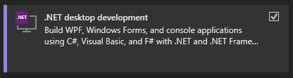

# Tracking Overview

## Setup

> **Note: This has to be done before you can work with Unity or Tracking**

With the new tracking build setup, the API binaries are no longer checked into the source tree. Also, the build is no longer coupled directly to Visual Studio.

To (re)build the API and automatically load it into the Unity project, use the `BuildForUnity.ps1` PowerShell script under the `src/Tracking` directory.

**If this is your first time running PowerShell scripts**: Open a PowerShell and run `set-executionpolicy unrestricted` to allow scripts to run.

**Important**: The _.NET Desktop Development_ package from Visual Studio is required for the build to work. If you have not yet installed it, please open your _Visual Studio Installer_, click on `Modify` on the version you use and install the following package (should be under the _Desktop & Mobile_ section):

## Architecture

The tracking system is a client-server architecture since it is not easily possible to integrate all the required libraries (such as Kinect and OpenCV) into the Unity application.

The main tracking project lives in `src/Tracking` and consists of multiple parts:

- `Tracking.API`: This provides the interface between server and client. It implements a simple TCP/IP connection for IPC between Unity and the tracking server.
- `Tracking.Core`: The tracking logic. Here live the actual algorithms used for tracking and classifying billiard balls.
- `Tracking.Debug`: Graphical debugger based on WinForms, which allows introspection into the various stages of the tracking algorithms.
- `Tracking.Model`: A dependencyless library providing the shared data model, such as balls and pockets.
- `Tracking.Server`: The actual server which unites the tracking system with the TCP server.

If you want to learn more about how the tracking algorithms work, check out the [Algorithm](algorithm.md) page.

The other half of the tracking system is in the Unity project, under the `Tracking` namespace. It integrates the Unity application with the IPC client provided by `Tracking.API`. To learn more about this part of the system, visit the [Unity](unity.md) page.