# Unity project

The Unity project part of the tracking component contains the `TrackingSender` and the `TrackingReciever`.
Depending on which mode is chosen within the Unity project you either track the data by using the tracking algorithm provided by the Tracking.API.dll (Camera Tracking), use the Unity internal implementation of the tracking (Direct Tracking) or no tracking (None). 

The `TrackingSender` is responsible for transferring data depending on the mode. Note: If you use Direct Tracking the Frame will automatically be set.

The `TrackingReceiver` will set the last build frame build by the TrackingAPI as the current frame and calls the Unity `OnUpdate` function with it's data.

## Setup Tracking Receiver

1. Now Drag & Drop the `TrackingReceiver` component onto a GameObject you wish.

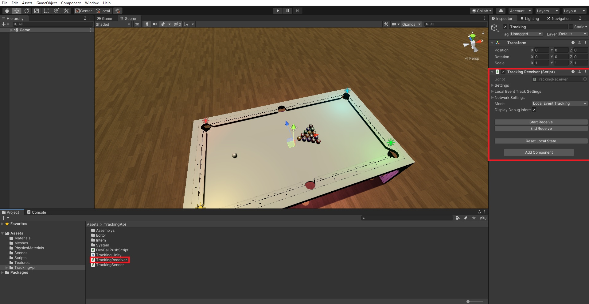   

2. Add Ball references to the `TrackingReceiver`.   
**The Balls need to have a `Rigidbody`-Component and a `SphereCollider`-Component attached to them.**   
Add References as follows (0 is the White cue and the index of the rest is identical to thier numbers):
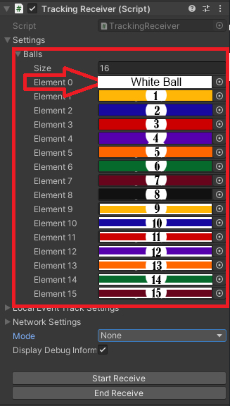   

3. Setup mode `Local Event Tracking` for testing.  
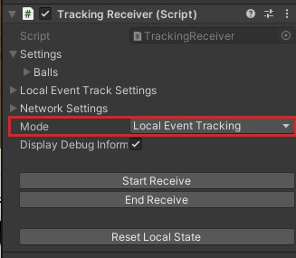   

There 2 Modes in the `TrackingReceiver` one is `Local Event Tracking` and the other one is `Networked Tracking`.   
`Local Event Tracking` - Is used for Debugging GameRules and runs fully local feedbacks everything that happened in the local scene.   
`Networked Tracking` - Receives data from a different application over the network. It needs to have a sender that emitts the data your application wants to receive.

4. Create a new empty GameObject and attach a `BoxCollider` to it. 
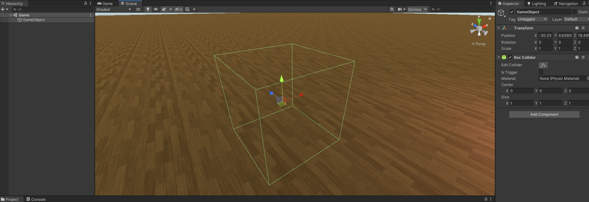   

Place this collider below a pocket so the balls will only trigger collision when they fall in:
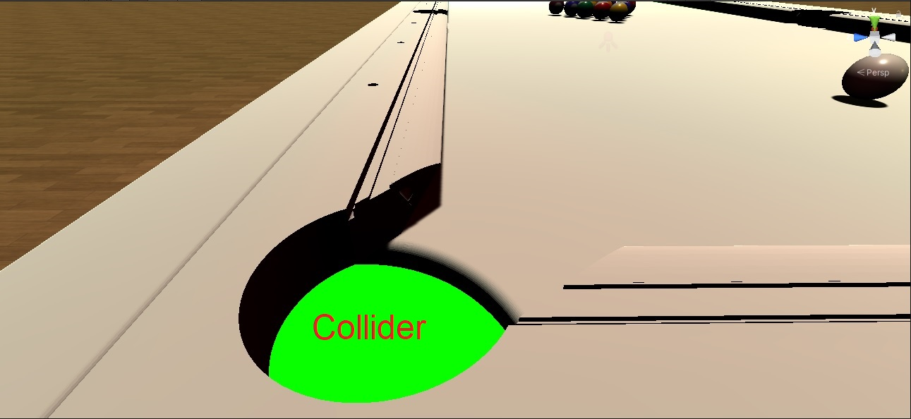   

Do this for every pocket. Then drag & drop them into their coresponding settings:
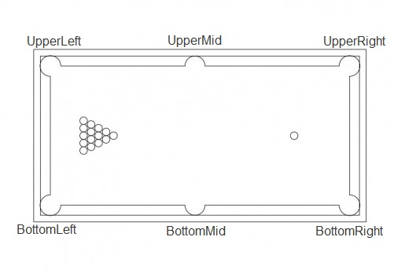   
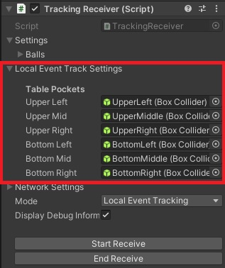   

5. Network Setup
Put the IP Adress of the Receiver and the Port to listen to in the coresponding settings:
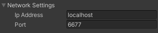

### Use Tracking Receiver
___
Now you can use the tracking receiver in your project. You can enable the `TrackingReceiver` by with the provided buttons or via script. In `Local Event Tracking` mode you can also reset the balls and the `TrackingReceiver` by clicking the `Reset Local State` button.
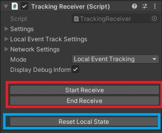   

To write scripts that use the tracked data see [Scripting with the tracking API](script.md).

## Setup Tracking Sender

1. Now Drag & Drop the `TrackingSender` component onto a GameObject you wish. Select the mode that you want to use for the tracking. If you are using the camera tracking mode you can skip the following setup steps.

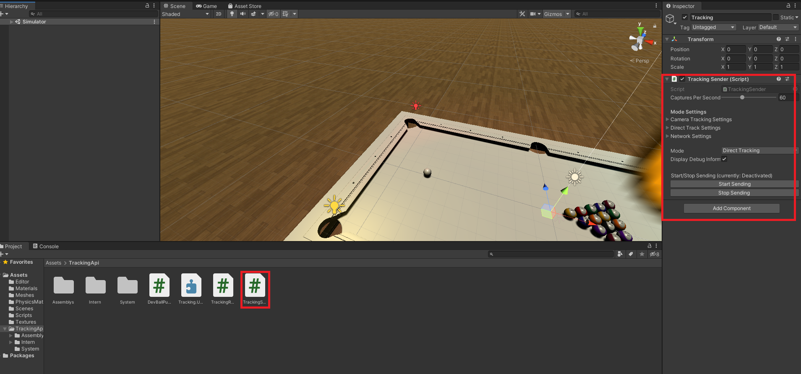

2. Add ball references to the `TrackingSender`.   
**The balls need to have a `Rigidbody` component and a `SphereCollider` component attached to them.**   
Add references as follows (0 is the white cue and the index of the rest is identical to their numbers):

3. Setup tablefield

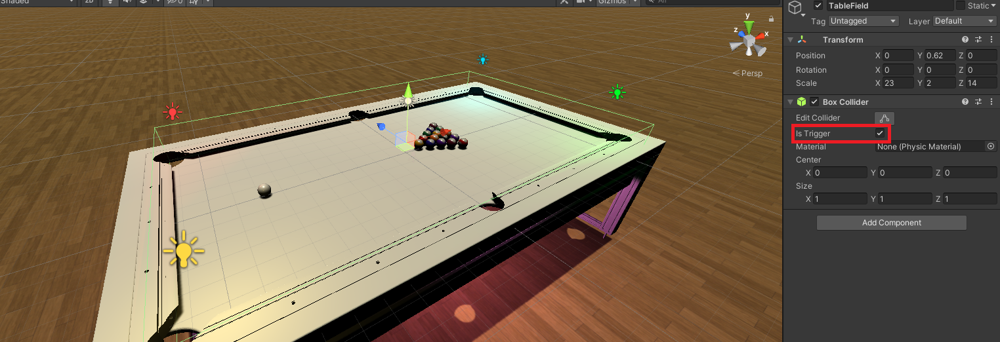

You will need a box collider which is as big as your table and is also a trigger.
Drag and drop this object into table field.

4. Setup Pockets
   

Place this collider below a pocket so the balls will only trigger collision when they fall in:
   

Do this for every pocket. Then drag & drop them into their corresponding settings:
   
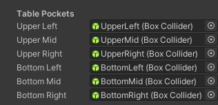

5. Network Setup
Put the IP address of the receiver and the port to send to in the corresponding settings:

Now everything should be ready to go.