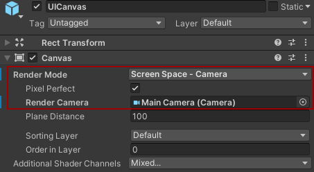

# Display Documentation
The Display-component within the project is responsible for displaying and managing the visual feedback for the players, which would normally be projected onto the playing-area of the real multimedia-billiard-table.
With the addition of the Simulator, this display is also to be included in the relevant Unity-scene so that it can been seen on the simulated billiard-table, in a fashion that is as close as possible to how it would work and look like on the real table.

## Code Structure
The code structure can be seen in the following class diagram:
***

***

## Display Prefab
The display component is implemented using a prefab, which is a reusable Asset that can contain multiple GameObjects in a hierarchy, with all their configurations. This way it can be reused in multiple Unity scenes; either on its own to just have the display that would be projected onto the real billiard-table or as a part of the Simulator's Game-scene, to make it appear on the simulated table. If the prefab is changed it will be automatically updated in all scenes it is used in. The prefab contains the [UI](#ui) as well as the [Logic](#logic). Currently it is present in the Game scene as a part of the BilliardTable GameObject, as well as the Display scene.

### Prefab Structure
The prefab is structured as follows: 


Note: The DynamicUI is above the StaticUI. This results in the StaticUI always rendering above the DynamicUI. 

The root GameObject called `Display` has the `TrackingReceiver` script attached to it. For more information on the `TrackingReceiver` check out the documentation of [Team-Tracking](../tracking/tracking.md).
Attaching the script to the display allows the display to receive tracking data from the TrackingAPI.
It also has all other GameObjects as its childs. At the core of the Display-component is a Canvas, which defines an area that all UI elements should be inside of.

### How to include
The prefab can be placed in a scene by dragging and dropping it from the project window on to the scene view. Depending on the use case a few things have to be changed inside the GameObject that is now present in the scene. If you want it to be displayed on top of the simulator billiard table you will have to change the Render Mode of the canvas inside the UICanvas to World Space and set the Event Camera to the Main Camera. You may also need to reposition the Display GameObject itself to get it to where you want it to be.


If you want the display component to be rendered on the entire screen so it can be displayed on the real billiard table, then you will have to set the Render Mode, of the canvas, to Screen Space - Camera and set the Render Camera to the Main Camera.



In this case you do not have to position the Display GameObject since it gets rendered on the full screen anyway.

## Logic
The Logic part of the display component is responsible for all the complex logic that is needed for the display component. It consists of the LogicController and its LogicComponents. These LogicComponents can be things like game logic are calculating where to shoot next. LogicComponents are also the only ones that can create DynamicUI elements like dynamic lines or dynamic text.

### Logic GameObject
The Logic GameObject has the `LogicController` script attached to it. In the inspector the script also has the `StaticUIController` and `DynamicUIController` attached to it.
This is done by dragging and dropping the GameObject, with the corresponding script attached to it, on to the field in the inspector.
Now the `StaticUIController` and `DynamicUIController` are accessible in the `LogicController`.


The Logic GameObject also has other GameObjects as childs. These child GameObjects have `LogicComponent` scripts attached to them.
This allows the `LogicController` to find all the relevant LogicComponents that are needed for the display.

### Creating Logic
To create a new LogicComponent you will have to go through a few steps before you can start coding the actual logic:

1. Create a new empty GameObject as a child of the Logic GameObject
2. Give the newly create GameObject a name. This name will also be the name you will use to activate/deactivate the LogicComponent.
3. Disable the GameObject in the inspector. (optional -> this way you will have to activate it first through the LogicController)
4. Create a new C# script.
5. Instead of deriving from MonoBehaviour your newly created C# class should inherit from LogicComponent.
6. Override the `LogicUpdate` function.
7. Override the `Init`, `OnActivate` and/or `OnDeactivate` functions if needed. (optional -> please do not use Unity event functions like Start or Update)
8. Add your LogicComponent script to your GameObject.

If you want to access StaticUIComponents in your Logic you can do so by adding members to your LogicComponent script as follows:

```csharp
[SerializeField] private DemoStaticUI demoStaticUI;
```
Note: `DemoStaticUI would be a class deriving from StaticUIComponent.`

If you want to create DynamicUI in you logic take a look at the section about [creating DynamicUI](#creating-dynamicui).

The `[SerializeField]` tag exposes the member in the inspector. This way you can drag and drop the GameObject containing the StaticUI onto your member in the inspector.

If you want to use DynamicUI in your Logic you can do so by doing the following:

1. Create a DynamicUIElement. (In this case a dynamic line)
```csharp
private DynamicLine _line = new DynamicLine(new List<Vector2>());
```
2. Register your DynamicUIElement in the DynamicUIController.
```csharp
DynamicUIController.RegisterDynamicUIElement(_line, name);
```
Note: `The DynamicUIController can be accessed since its present in all LogicComponents. The member "name" is part of the GameObject that you created earlier and corresponds to the GameObjects name.`

3. Update your DynamicUIElement in your code.
```csharp
_line.Points = new List<Vector2> {new Vector2(0, 0), new Vector2(1, 1)}; // draws the line from the bottom left to the top right of the canvas
```
4. When you are done with your DynamicUIElement you may remove it frome the LogicController.
```csharp
DynamicUIController.DestroyDynamicUIElement(_line);
```
Note: `Do not use your DynamicUIElement anymore after destroying it in the DynamicUIController!`

## UI
The UI portion of the display component is divided into two subcategories, DynamicUI and StaticUI. It also contains the actual canvas that UI elements get rendered on.

### UICanvas
The UICanvas GameObject is what allows the rendering of the UI. It has a canvas attached to it which is needed to render the UI. In addition it also has a 2D mask which prevents UI elements from rendering outside of the canvas. And finally it also has the `UICanvas` script attached to it. It gives easy access to functionalities like mapping normalised coordinates to coordinates on the canvas and vice versa.


### Static UI
StaticUI is UI that is created before runtime and also doesn't really change at runtime expect for text or text color and such things. It's mostly used for things like menus or displaying information like player names. There can always only be one StaticUIComponent active at all times, but you can switch between StaticUIComponents at runtime.

#### GameOverlay
Here is everything that is displayed during the game itself, e.g. names of the players, how many balls have to be pocketed or the icons for the groups and for the 9Ball mode.

The attached script is called `GameOverlay`.

You can create a new GameObject as child of GameOverlay. To add it to the prefab right click on the GameObject and then go to Added GameObject > Apply to prefab Display.

See [creating a StaticUIComponent](#creating-a-staticuicomponent).

#### StaticUI GameObject
The StaticUI GameObject has the `StaticUIController` script attached to it. In the inspector the script also has the `LogicController` attached to it. This is done by dragging and dropping the Logic GameObject onto the `StaticUIController` script.


#### Creating a StaticUIComponent
If you want to create a new StaticUIComponent there are a few steps you will have to go through:

1. Create a empty GameObject as a child of the StaticUI GameObject.
2. Give your GameObject a name.

Note: `The name of your StaticUI has to be unique since it is the name used for switching between StaticUIComponents.`

3. Disable your GameObject.

Note: `If you want your StaticUIComponent to be active at the start of the scene then leave it enabled and disable all others.`

4. Create your UI inside your GameObject. (For this example we are going to add a button and a simple text element)


5. Create a new C# script and inherit from StaticUIComponent.
6. Override the `Init`, `OnActivate` and/or `OnDeactivate` functions if needed. (optional -> please do not use Unity event functions like Start or Update)
7. Finally add your script to your GameObject.

To add some functionality to your StaticUI we will use the script that you created previously. Lets say you want to change the text when you click the button. To do so we are going to do the following:

1. Add a private member for your text
```csharp
[SerializeField] private Text text;
```

2. Drag and drop your text element onto the member in the inspector.

3. Now add a callback handler for the button in your script.
```csharp
void OnButtonClick()
{
    text.text = "Button Clicked :)";
}
```

4. Finally set the On Click event in your button by dragging and dropping the GameObject with your script onto the On Click of your button and select the `OnButtonClick` function.


In some cases you also want to expsoe certain elements of the UI to other scripts (mainly LogicComponents). To do so you can add public properties to your script. Lets say you want to edit the text of your text element from another script. To do so you could do the following:

```csharp
public string Text
{
    get => text.text;
    set => text.text = value;
}
```
By using a property instead of making the whole text element public, others can only change the actual text string of your text element. If you made the text element public others could also change things like position, rotation and more. In most cases you do not want this. 
Now you can access the text string in other scripts.

```csharp
exampleStaticUI.Text = "Some new text :D";
```

For more information on how to access StaticUIComponents in your LogicComponent, see the section about [creating Logic](#creating-logic).

### Dynamic UI
DynamicUI is UI that gets created, changed and eventually removed at runtime. These can be things like lines, text, circles or whatever you can think of. DynamicUI can only be created inside of LogicComponents since they are the only ones that have access to the DynamicUIController.

#### DynamicUI GameObject
The DynamicUI GameObject has the `DynamicUIController` script attached to it which will dynamically create child GameObject at runtime to display dynamic ui elements on the canvas.

#### Creating new DynamicUIElements

Creating a new DynamicUIElement is rather simple:

1. Create a new C# script and give name it properly. (e.g. DynamicLine)
2. Make your class inherit from DynamicUIElement.
3. Implement the abstract function `InitializeGameObject`. This function is responsible for initializing the GameObject which will be added to the scene at runtime.
