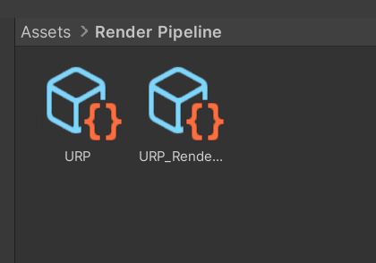

# Firework Prefab

This is an explanation of what you need and what to do to use the existing firework prefab. 

## Preparation

1. To display the firework prefab you need the following packages: `Visual Effect Graph` and `Universal Render Pipeline`. Add them using the package manager: 

2. Create a `Render Pipeline` folder inside `Assets`. This step is optional, but should be done for consistency. 

3. Create an `Universal Render Pipeline` object as shown below:

Now there are the following objects shown inside the recently created folder `Render Pipeline`:

4. Go to project settings and select `Graphics`. Drag and drop the `URP` object into `Graphics`. 

5. After that the colors get pink, so you have to do the following to fix that: 

## Usage

You can find the firework prefab in Unity inside of `Assets/Visual Effects`. If you want to use it, drag and drop it into the outline of the project (left upper corner in Unity, called *Hierarchie*). 

