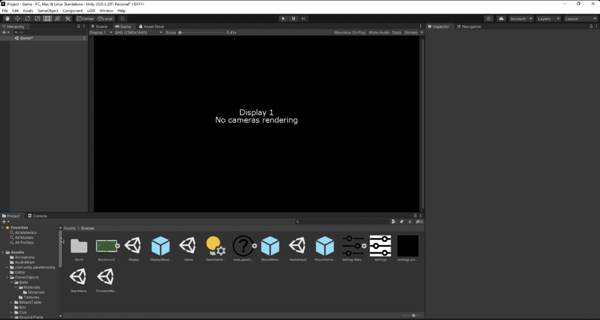
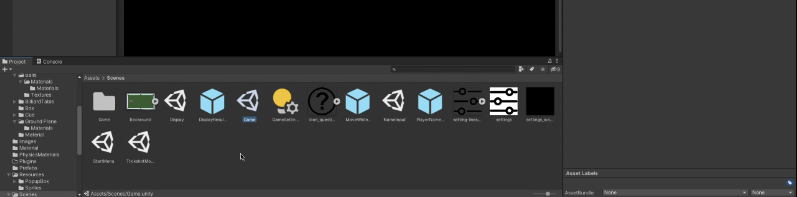
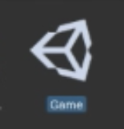
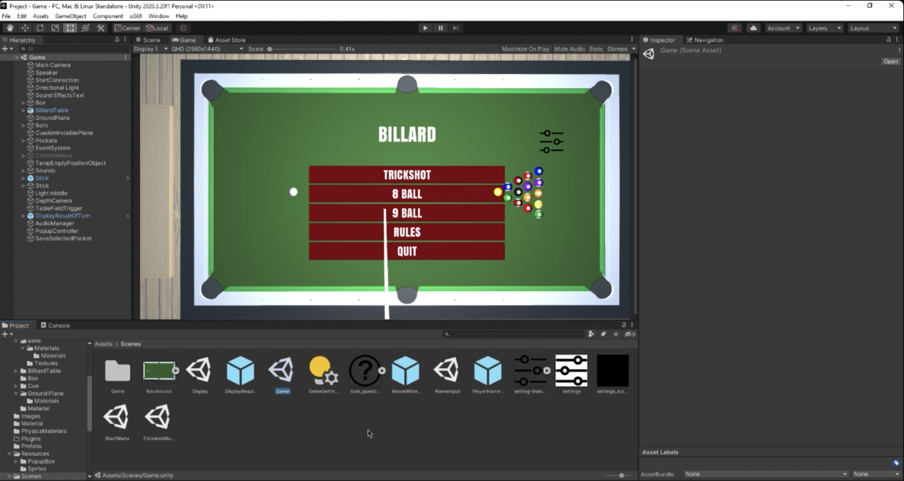
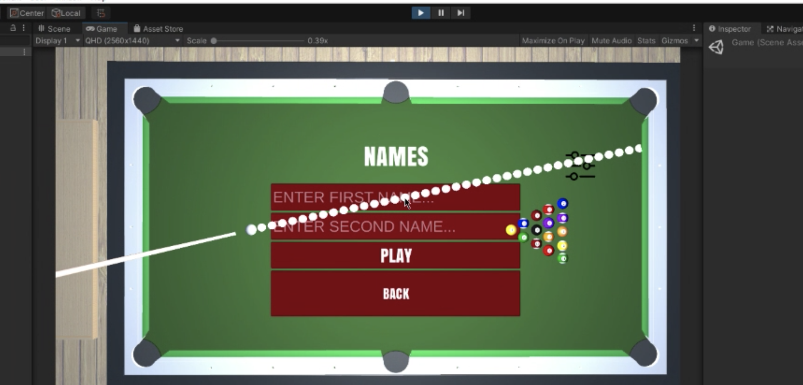
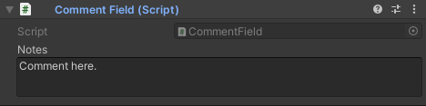
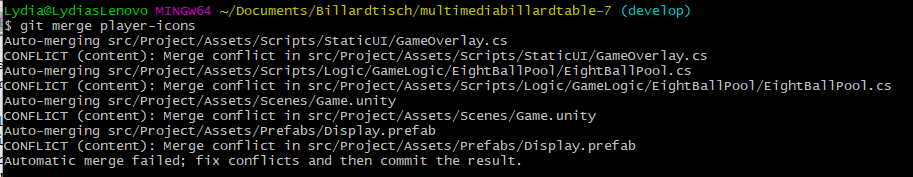
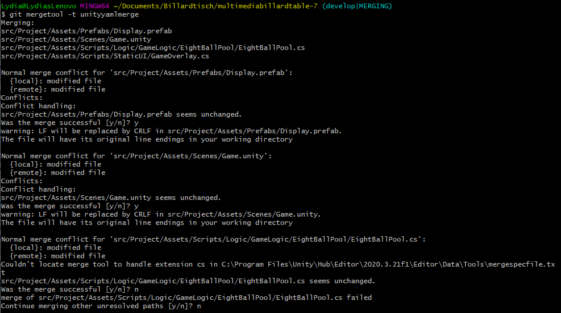

# Unity

## How to run the Unity Project

1. Install Unity.
2. Open 'Project'-Folder as project in unity. This takes some time.
3. When you first open it, no scene or object is shown on the display. Do the following steps:
        a) Go to the 'Project' tab in the down left corner. 
            
        b) Look for the folder 'Assets' and uncollapse it.
        c) Look for the subfolder Scenes and open it.
            
        d) Double click on the 'Game' object with the unity cube as its symbol.
            
4. Now the scene should be loaded and the game is ready to play.
        
5. Click on the play-button to start the game. Enjoy!
        

## Documentation for GameObjects
We would like developers who work on Unity-scenes to add comments to the GameObjects that are parts of scenes when required. This can be important when you have objects whose purpose and behavior are not self-evident.  
To do that, simply add the ``CommentField``-script to the desired GameObject of your scene and a new field will appear in the Inspector-tab for that object, where you can write your comments.

  
Do not forget to save your changes to the scene when you are done.
  
There are also further options to add headers and tooltips to the fields that are displayed in the Inspector via additions to your scripts. You may use these at your own discretion. Examples and instructions for how to add these can be found [here](https://forum.unity.com/threads/add-info-text-notes-into-the-inspector.265330/).

## Merge Conflicts with Unity

### Preparation for merge on Windows
Here is a list of [Diff Tools for Windows](https://www.git-tower.com/blog/diff-tools-windows/). 

You can use these tools to merge the .cs files of the project. I used Meld and it worked fine.

### Preparation for merge in Unity
Unity can sometimes produce merge conflicts that are difficult to resolve. Those type of merge conflicts only appear between Unity `Scene`-Files (Files with `*.unity` / `*.unity.meta` extension.) In general you should try to avoid getting into those with good team communication.

UnityYAMLMerge is used to merge scene and prefab files. See [smart merge](https://docs.unity3d.com/Manual/SmartMerge.html). To customize how UnityYAMlMerge merges files, please go to the section `Configuring mergerules.txt` of the smart merge site.

1. Go to the git folder of the project and open the config file. The file should be located in the root of your project folder and then `.git/config`.
Note: The .git folder is hidden, so you would need to make it visible.
[Show hidden files and folders for Windows](https://support.microsoft.com/en-us/windows/view-hidden-files-and-folders-in-windows-97fbc472-c603-9d90-91d0-1166d1d9f4b5)
[Show hidden files and folders for MacOS](https://www.pcmag.com/how-to/how-to-access-your-macs-hidden-files#:~:text=Press%20Command%20%2B%20Shift%20%2B%20.,still%20take%20a%20peek%20inside.) 

2. Add the following:
    ```
    [merge]
	    tool = unityyamlmerge

    [mergetool "unityyamlmerge"]
        trustExitCode = false
        cmd = '<path to UnityYAMLMerge>' merge -p "$BASE" "$REMOTE" "$LOCAL" "$MERGED"
    ```
    The path could look like this:
    ```
    'C:\\Program Files\\Unity\\Hub\\Editor\\2020.3.21f1\\Editor\\Data\\Tools\\UnityYAMLMerge.exe'
    ```
    On Windows it is important to add the double \ in order for it to work.

 ### Merge
 1. Make sure your branch is ready and everything is added and committed. Please check the golden path in the [Git tutorial](../help/git.md). Keep it small: Only changes that belong to your issue.
 2. Check out your target branch for the merge, e.g. develop. 
 (As a Maintainer I merged on `develop`. So the following example will lean on that. Of course you can use any other branch or create a new branch as the target of the merge.)
 3. Pull the changes of your desired branch and check the status.
 4. Type in the branch you want to merge (here `player-icons`) into your target branch (here `develop`).
    
    
    
    Git will try and auto-merge the files and will fail with the .unity and .prefab files.
 6. Type in the following command ``` git mergetool -t unityyamlmerge```.
    
    

7. The merges for the unity files should (hopefully) be merged by the UnityYAMLMerge tool. For the .cs files use one of the proposed diff tools, e.g. Meld.

8. When you are finished, check the status of your branch, then commit and push.